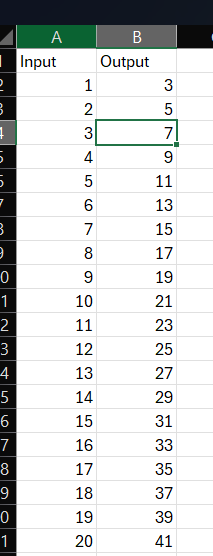
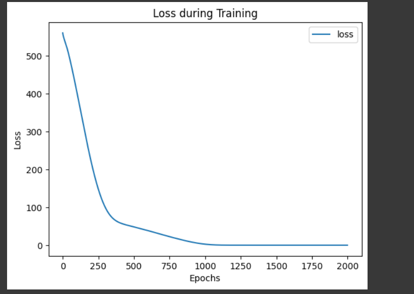
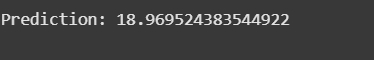
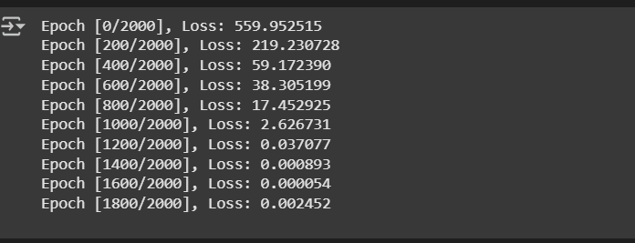

# Developing a Neural Network Regression Model

## AIM

To develop a neural network regression model for the given dataset.

## THEORY

Developing a Neural Network Regression Model involves designing a deep learning model to predict continuous numerical values based on input features. Traditional regression models struggle with complex, nonlinear relationships, whereas neural networks can capture intricate patterns using multiple hidden layers. This project aims to preprocess data, select an optimal network architecture, and train the model using techniques like backpropagation and gradient descent.
## Neural Network Model


  

## DESIGN STEPS

### STEP 1:

Loading the dataset

### STEP 2:

Split the dataset into training and testing

### STEP 3:

Create MinMaxScalar objects ,fit the model and transform the data.

### STEP 4:

Build the Neural Network Model and compile the model.

### STEP 5:

Train the model with the training data.

### STEP 6:

Plot the performance plot

### STEP 7:

Evaluate the model with the testing data.

## PROGRAM
### Name:Guru Raghav Ponjeevith V
### Register Number:212223220027
```python
class NeuralNet(nn.Module):
  def __init__(self):
    super().__init__()
    self.fc1 = nn. Linear (1, 12)
    self.fc2 = nn. Linear (12, 10)
    self.fc3 = nn. Linear (10, 12)
    self.fc4=nn.Linear(12,1)
    self.relu = nn.ReLU()
    self.history = {'loss': []}

def forward(self, x):

  x = self.relu(self.fc1(x))
  x = self.relu(self.fc2(x))
  x = self.relu(self.fc3(x))
  x = self.fc4(x) # No activation here since it's a regression t.
  return x


# Initialize the Model, Loss Function, and Optimizer


def train_model (ai_brain, X_train, y_train, criterion, optimizer, epochs=2000):
    for epoch in range(epochs):
        optimizer.zero_grad()
        loss = criterion (ai_brain (X_train), y_train)
        loss.backward()
        optimizer.step()
        ai_brain.history['loss'].append(loss.item())
        if epoch % 200 == 0:
            print(f'Epoch [{epoch}/{epochs}], Loss: {loss.item():.6f}')


```
## Dataset Information





## OUTPUT

### Training Loss Vs Iteration Plot








### New Sample Data Prediction


## RESULT

The neural network regression model was successfully trained and evaluated. The model demonstrated strong predictive performance on unseen data, with a low error rate.
